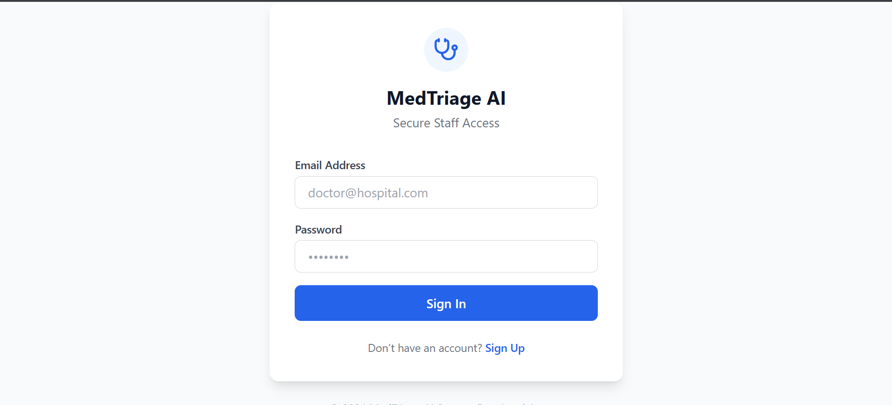
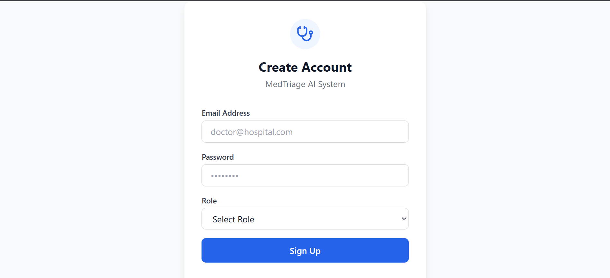
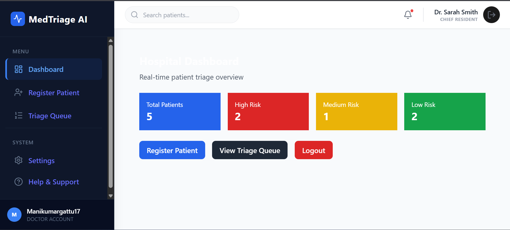
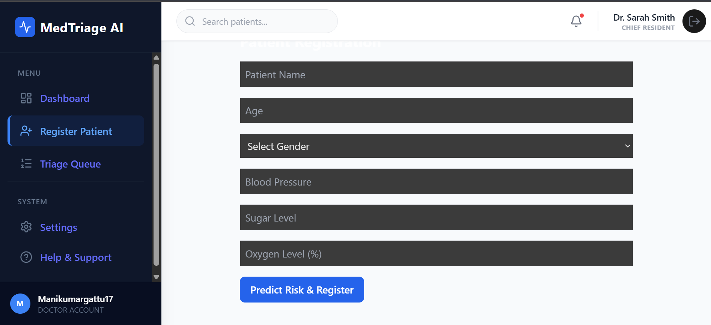
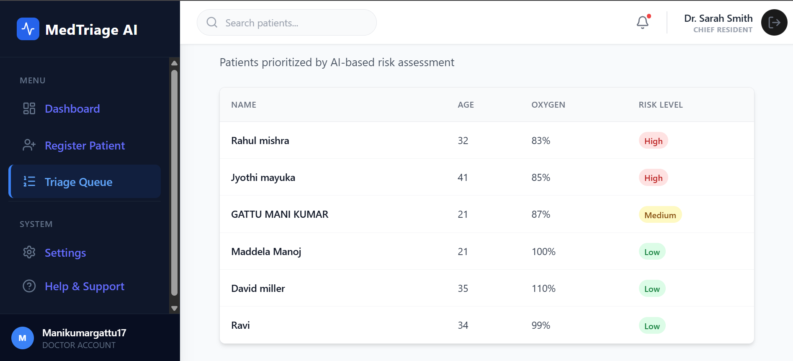

## 🏥 AI Patient Triage System

An AI-powered full-stack healthcare application that assists hospitals in patient triage, risk prediction, and real-time monitoring.  
The system helps medical professionals prioritize patients based on health risk using machine learning.

---

## 🎯 Problem Statement

In hospitals and emergency departments, patients arrive with varying severity levels.  
Manual triage is time-consuming and can delay critical care.

This system automates patient risk assessment using AI to improve decision-making and response time.

---

## 🚀 Key Features

- 🔐 Real-world authentication (Sign Up & Sign In)
- 👥 Role-based access (Doctor / Nurse / Admin)
- 🧠 AI-based patient risk prediction (High / Medium / Low)
- 📝 Patient registration with vital parameters
- 📊 Dashboard analytics with real-time stats
- 📋 Priority-based triage queue
- 👤 Dynamic user profile in sidebar

---

## 🧠 AI / Machine Learning Overview

### Input Features
- Age
- Blood Pressure
- Sugar Level
- Oxygen Saturation

### Model Details
- Algorithm: Logistic Regression
- Preprocessing: StandardScaler
- Output: Risk Level with probability score

### ML Artifacts
- model.pkl
- label_encoder.pkl

---

## 🛠️ Tech Stack

### Frontend
- React (Vite)
- Tailwind CSS
- React Router
- Lucide Icons

### Backend
- FastAPI
- SQLAlchemy
- MySQL
- Passlib (Password Hashing)
- CORS Middleware

### Machine Learning
- Python
- Pandas
- NumPy
- Scikit-learn
- Joblib

---

## 📂 Project Structure

ai-patient-triage-system/
│
├── backend/
│ ├── main.py
│ ├── models.py
│ ├── schemas.py
│ ├── crud.py
│ ├── database.py
│ ├── auth.py
│ ├── ml/
│ │ ├── model.pkl
│ │ ├── label_encoder.pkl
│ │ └── predict.py
│ └── requirements.txt
│
├── frontend/
│ ├── src/
│ ├── package.json
│ └── vite.config.js
│
├── screenshots/
│ ├── login.png
│ ├── signup.png
│ ├── dashboard.png
│ ├── register_patient.png
│ └── triage_queue.png
│
└── README.md


---

## ⚙️ Setup Instructions

### Backend Setup

```bash
cd backend
python -m venv myenv
myenv\Scripts\activate
pip install -r requirements.txt
uvicorn main:app --reload

Backend URL:
http://127.0.0.1:8000

Swagger UI:
http://127.0.0.1:8000/docs
```
### Frontend setup

```bash
cd frontend
npm install
npm run dev

Frontend URL:
http://localhost:5173
```
### 🔐 Authentication Flow

1. User signs up with email, password, and role
2. Password is securely hashed and stored in the database
3. User logs in with valid credentials
4. Authenticated users can access dashboard and features
5. Logout clears session and redirects to login

## 📸 Screenshots

### 🔐 Login Page


### 📝 Sign Up Page


### 📊 Dashboard


### 🧾 Patient Registration


### 🚑 Triage Queue


### 🎬 Application Demo Flow

1. User signs up and logs in
2. Dashboard shows real-time patient statistics
3. Doctor registers a patient with vitals
4. AI model predicts patient risk level
5. Patient appears in triage queue based on priority
6. Sidebar updates with logged-in user details
7. User logs out securely

### 🌍 Real-World Use Cases

* Emergency departments
* Hospital OPDs
* Rural healthcare systems
* Smart hospital platforms
* Clinical decision support systems

### ⭐ Why This Project Stands Out

* Complete full-stack architecture
* Real authentication (not dummy login)
* AI integrated into real healthcare workflow
* Clean UI with production-ready structure
* Strong portfolio and interview project

## 👨‍💻 Author
#### Mani Kumar Gattu
Aspiring Full-Stack Developer | AI/ML Enthusiast
